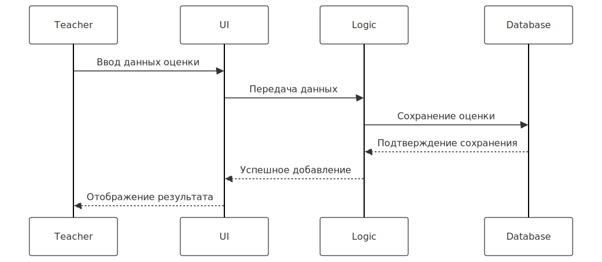

1. Установка зависимостей (requirements.txt):

```
pip install -r requirements.txt
```

2. Запуск программы:

```
python main.py
```

3. Действия в консоли после запуска:

   Главное меню:

   В консоли появится следующее меню:

```--- Main Menu ---
1. Login
2. Exit
```

4. Действия в меню (после входа):

Администратор (Admin):
После ввода 1 и user_id 1 появится меню администратора:

```
 --- Admin Menu ---
1. Manage Users
2. Manage Groups
3. Manage Subjects
4. Manage Schedule
5. Manage Semesters
6. Assign Subject to Semester
7. Back to Main Menu4
```

Введите соответствующую цифру (от 1 до 7) и нажмите Enter для выбора пункта меню.
В зависимости от выбора, будет запрошен ввод дополнительных данных.
Например, если выберите 1 (Manage Users) то появится меню:

```
--- Manage Users Menu ---
1. Create User
2. List Users
3. Back to Admin Menu
```

5. Преподаватель (Teacher):

После ввода 1 и user_id преподавателя появится меню преподавателя:

```
    --- Teacher Menu ---
   1. Add Grade
   2. Add Attendance
   3. View Report
   4. View Schedule
   5. Back to Main Menu
```

6. Студент (Student):

После ввода 1 и user_id студента появится меню студента:

```
--- Student Menu ---
1. View Grades
2. View Attendance
3. View Schedule
4. View Notifications
5. Back to Main Menu
```

Диаграммы

1. Диаграмма классов (Classes Diagram)



2. Диаграмма последовательностей (Sequence Diagram)



3. Диаграмма компонентов (Components Diagram)


4. Диаграмма вариантов использования (Use Cases Diagram)


5. Диаграмма состояний для студента



6. Диаграмма состояний процесса добавления оценки студенту




Добрый день, на связи Никита Жильцов и Доценко Даниил. Мы студенты M30-411Б-21 из 5ой бригады. Мы очень сильно извиняемся за самодеятельность и нарушение порядка сдачи. Понимаем, что уже поздно,  что-то менять, но мы все-таки попытались. 
Поэтому просим вас дать обратную связь о том что нам необхоимо сделать, что бы сдать этот предмет. Еще раз извините и спасибо за понимание. 
